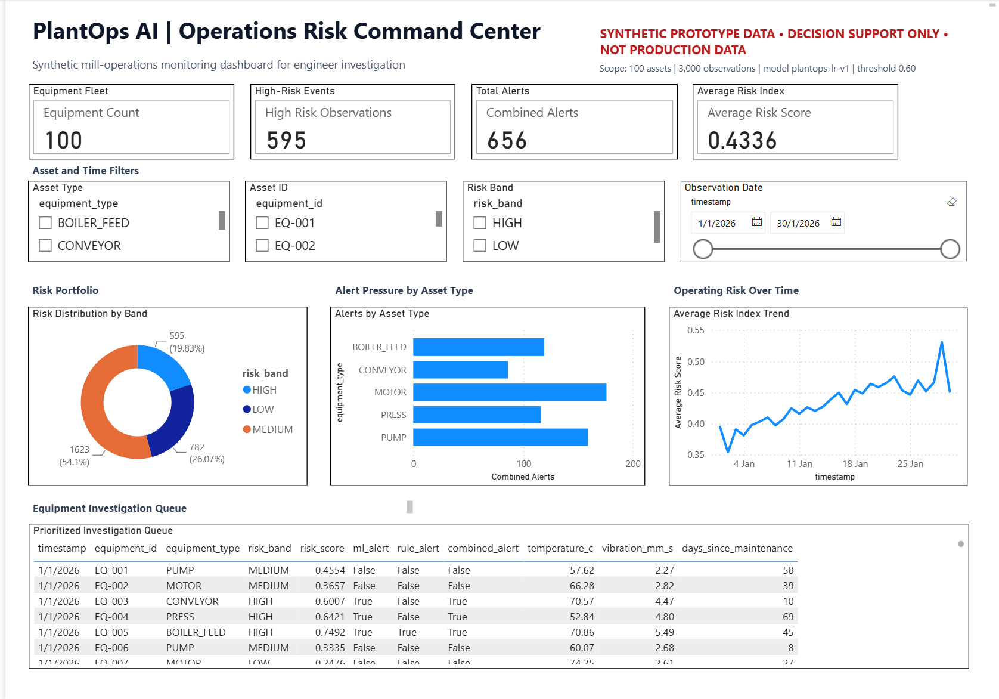

# PlantOps AI - Operational Risk Monitoring Prototype

PlantOps AI is a synthetic, end-to-end prototype for operational risk monitoring and predictive maintenance decision support. It demonstrates how equipment observations can flow through validation, feature preparation, machine learning scoring, deterministic rule alerts, and a Power BI operations dashboard.

This project is an independent portfolio demonstration. It uses synthetic data only and is not based on confidential or production company data.

## Executive Summary

PlantOps AI simulates a mill or plant operations environment with equipment telemetry and maintenance-related features. The system scores observations using a frozen logistic-regression model and combines the model output with deterministic rule alerts to prioritize equipment observations for engineer investigation.

Current verified dashboard reference values:

| Metric | Value |
|---|---:|
| Equipment assets | 100 |
| Total observations | 3,000 |
| High-risk observations | 595 |
| ML alerts | 595 |
| Rule alerts | 178 |
| Combined alerts | 656 |
| Average risk score | 0.4336 |

Important interpretation:

- These are full synthetic dataset dashboard counts.
- They are visualization and decision-support references.
- They are not holdout model-performance metrics.
- Risk scores are uncalibrated and must not be interpreted as literal failure probabilities.

## Power BI Dashboard



The Power BI dashboard is the final consumption layer of the project.

Dashboard name:

```text
PlantOps AI - Operational Risk Dashboard
```

Main report page:

```text
Operational Risk Overview
```

Dashboard interface:

```text
PlantOps AI | Operations Risk Command Center
```

The dashboard includes:

- KPI cards for equipment fleet, high-risk events, total alerts, and average risk index
- Slicers for asset type, asset ID, risk band, and observation date
- Risk distribution by band
- Alert pressure by asset type
- Average risk trend over time
- Prioritized equipment investigation queue
- Visible decision-support disclaimer

Open the PBIP in Power BI Desktop (path from the project folder):

```text
powerbi\PlantOps AI - Operational Risk Dashboard.PBIP\PlantOps AI - Operational Risk Dashboard.pbip
```

After opening, click:

```text
Refresh now
```

If Power BI cannot locate the CSV source, update the `CsvPath` parameter to:

```text
data\processed\plantops_powerbi.csv
```

Path from the project folder on Linux or WSL:

```text
data/processed/plantops_powerbi.csv
```

## Project Architecture

High-level flow:

```text
Synthetic equipment data
        |
        v
Data validation and feature preparation
        |
        v
Frozen ML model scoring
        |
        v
Rule-based alert logic
        |
        v
Combined risk and alert export
        |
        v
Power BI operations dashboard
```

The system keeps the engineer in the loop. A high-risk score or alert prioritizes an observation for review; it does not automatically prescribe maintenance or shut down equipment.

## Model and Scoring Notes

Frozen model:

```text
plantops-lr-v1
```

Alert threshold:

```text
0.60
```

Risk bands are generated by the existing backend logic and should remain unchanged for reproducible dashboard verification.

Do not alter the frozen Python/ML backend, the model version, the alert threshold, or risk-band definitions when reproducing the dashboard.

## Model Test Result (locked holdout)

The model was tested once on 20 machines it had never seen (600 observations, 10 failure cases).

| Result | Count |
| --- | --- |
| Failures flagged | 4 |
| Failures missed | 6 |
| False alarms | 106 |
| Correctly quiet | 484 |

The model shows some ranking signal but too many false alarms for real use.
It is a method demonstration, not a production-ready model.

- Rule alert limits (prototype values): temperature >= 90 C, vibration >= 6 mm/s, load >= 95%.
- Risk bands: LOW below 0.30, MEDIUM 0.30 to below 0.60, HIGH 0.60 or more.
- Data split by machine: 60 train, 20 validation, 20 test.
- Quality checks: 49 automated tests, run by GitHub Actions on every push.

## Data

Primary Power BI export:

```text
data/processed/plantops_powerbi.csv
```

Current generated dataset:

- 3,000 observations
- 100 synthetic equipment units
- 5 equipment types
- 20 columns
- Model version: `plantops-lr-v1`

Key fields include:

- `timestamp`
- `equipment_id`
- `equipment_type`
- `temperature_c`
- `vibration_mm_s`
- `pressure_bar`
- `motor_current_a`
- `runtime_hours`
- `days_since_maintenance`
- `load_pct`
- `failure_next_7d`
- `risk_score`
- `risk_band`
- `ml_alert`
- `rule_alert`
- `combined_alert`
- `model_version`
- `score_interpretation`
- `decision_support_only`
- `synthetic_data`

## Power BI Measures

The dashboard preserves the following semantic model measures:

```DAX
Equipment Count =
DISTINCTCOUNT(PlantOps[equipment_id])

High Risk Observations =
CALCULATE(
    COUNTROWS(PlantOps),
    PlantOps[risk_band] = "HIGH"
)

Combined Alerts =
CALCULATE(
    COUNTROWS(PlantOps),
    PlantOps[combined_alert] = TRUE()
)

Average Risk Score =
AVERAGE(PlantOps[risk_score])

ML Alerts =
CALCULATE(
    COUNTROWS(PlantOps),
    PlantOps[ml_alert] = TRUE()
)

Rule Alerts =
CALCULATE(
    COUNTROWS(PlantOps),
    PlantOps[rule_alert] = TRUE()
)

Total Observations =
COUNTROWS(PlantOps)
```

Expected measure values after refresh:

```text
Equipment Count: 100
High Risk Observations: 595
Combined Alerts: 656
Average Risk Score: 0.4336
ML Alerts: 595
Rule Alerts: 178
Total Observations: 3000
```

## Repository Structure

The `data/` and `models/` folders are created when the pipeline runs. They are not stored in the repository.

```text
.
├── data/
│   └── processed/
│       └── plantops_powerbi.csv
├── docs/
├── models/
├── powerbi/
│   ├── PlantOps AI - Operational Risk Dashboard.pbix
│   ├── PlantOps AI - Operational Risk Dashboard.PBIP/
│   └── README.md
├── reports/
├── src/
├── tests/
├── README.md
├── pyproject.toml
└── requirements.txt
```

## Setup

Create or activate the Python environment:

```bash
python3 -m venv .venv
source .venv/bin/activate
pip install -r requirements.txt
```

Install the package in editable mode if needed:

```bash
pip install -e .
```

## Generate Power BI Export

Generate the dashboard dataset:

```bash
python -m plantops_ai.powerbi_export
```

Expected output:

```text
data/processed/plantops_powerbi.csv
```

## Run Tests

Run the test suite:

```bash
pytest
```

Run formatting or linting if configured:

```bash
ruff check .
```

## Project Summary

In short:

```text
PlantOps AI demonstrates an end-to-end decision-support pipeline for operational risk monitoring. Synthetic equipment observations are validated, scored by a frozen logistic-regression model, combined with deterministic rule alerts, and exported to Power BI for engineer investigation. The dashboard is not showing production data or holdout model performance. It shows full synthetic dataset monitoring counts for a human-in-the-loop operations workflow.
```

Key points:

- End-to-end pipeline, not just a model notebook
- Reproducible synthetic data
- Frozen model version for stable demonstration
- Clear separation between ML alerts and rule alerts
- Human-in-the-loop decision support
- Power BI dashboard as the operational consumption layer

## Safety and Data Disclaimer

This project uses synthetic prototype data only.

The dashboard and risk scores are for decision-support demonstration. They are not production recommendations, calibrated failure probabilities, or automated maintenance instructions.


